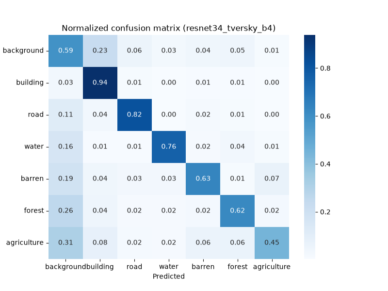

# 04. Land-cover segmentation on LoveDA, a post-mortem

## Question

This project has two goals.

1. Understand the U-Net architecture from the inside, and learn how to optimize it and tune its hyperparameters for a given task.
2. Find out whether a pretrained encoder and a tuned loss would beat a U-Net trained from scratch on LoveDA, and which model was worth deploying.

## Setup

| | |
|---|---|
| Dataset | LoveDA (urban and rural), trained on the train split, evaluated on the official validation split |
| Input | 1024 px tiles (bilinear resize), raw 0-255 RGB, ImageNet normalization done inside the model for fine-tuning |
| Classes | 8 outputs, no-data ignored, 7 evaluated classes |
| Hardware | single RTX 3090, 64 GB RAM, Ryzen 9 3950X |
| U-Net from scratch | lr 3e-4, 150 epochs max, early stopping patience 32 |
| U-Net ResNet34 fine-tuning | ResNet34 ImageNet encoder via `segmentation_models_pytorch`, encoder lr 1e-4, decoder lr 3e-4, encoder frozen for 3 epochs, 150 epochs max, patience 12 |
| SegFormer-B2 fine-tuning | `nvidia/mit-b2` via `transformers`, encoder lr 6e-5, head lr 6e-4, encoder frozen for 3 epochs, 150 epochs max, patience 12 |
| Optimizer (fine-tuning) | AdamW (weight decay 1e-4), ReduceLROnPlateau (patience 10, factor 0.5) |
| Batch size | 4 |
| Loss | 0.5 × weighted cross-entropy + 0.5 × Tversky, class weights computed on the first 500 training tiles |
| Data augmentation | horizontal and vertical flips, rotation ±30°, **scratch runs only** (see note below) |
| Checkpoint selection | lowest validation loss, deterministic validation for every run except 4a |
| Metrics | mIoU (simple mean over the 7 classes), IoU per class, row-normalized confusion matrices, all computed on the raw argmax without post-processing |

**Tversky settings.** In the Tversky loss, α weights false positives and β weights false negatives. A higher α on a class punishes the model for predicting that class where it is not. Defaults are 0.5/0.5, and the following classes were tuned.

| Class | α / β | Intent |
|---|---|---|
| building | 0.75/0.25, then 0.85/0.15 | stop buildings from spreading over the background |
| barren | 0.60/0.40 (from run 6) | same logic, on a weaker class |
| road, water | 0.40/0.60 (all fine-tuning runs) | favor recall on thin or rare structures |

**Note on augmentation.** Because of a mix-up in the dataset loading, all fine-tuning runs were trained without augmentation (resize only). This was not intended and has been fixed in the scripts since, but every fine-tuning number below comes from runs without augmentation.

**Note on the test set.** The LoveDA test labels are not public, so every score below is measured on the split that also selected the checkpoints. The scores are comparable to each other, but slightly optimistic in absolute terms.

## Phase 1, Tuning on U-Net

The first phase was mainly focused on building the U-Net and understanding how it behaves. I started optimizing before having a reliable evaluation protocol, and these runs were validated on augmented tiles.

I compared runs on mIoU and per-class IoU, while the validation loss was only used to pick the best checkpoint within each run. Since the loss itself changed between runs, comparing validation losses from one run to the next would not have meant anything.

The early runs showed heavy confusion on some classes, the background in particular, which is over-represented in the dataset and bled over almost everything. I first moved to a CE + Dice loss, then to CE + Tversky, which let me choose class by class whether the model should be punished more for missing a class or for over-predicting it.

Each scratch run took about 6 h on the configuration above. Before moving to fine-tuning, I tried adding a fifth depth level to the U-Net. Training went from 6 h to 8 h, the checkpoint grew from 118 MB to 450 MB, and the results were worse than with four levels, so I dropped it.

| # | Run | Change |
|---|---|---|
| 1 | scratch | `ignore_index` fix, CE + Dice |
| 2 | scratch | class weights, CE + Tversky (building 0.75/0.25) |
| 3 | scratch | depth 5, abandoned |

Numbers are in the appendix, and they can only be compared with each other.

## Phase 2, Moving to fine-tuning and diagnosis

I then moved to fine-tuning (run 4a, ResNet34 encoder, same loss as run 2) to see whether a pretrained model could do better on the same task. This is where the protocol problem showed up.

**The pivot.** Re-evaluated on a deterministic validation set, the same checkpoint dropped from 0.487 to 0.445 mIoU, and building fell from 0.599 to 0.364 IoU. That gap changed how I read everything before it. For run 4a, the validation loss that selected the checkpoint was computed on randomly flipped and rotated tiles, so it changed from one epoch to the next even when the weights barely moved. The selected epoch was partly the one with a lucky draw, and the mIoU measured on that same draw inherited the optimism. Rotation also leaves ignored corners in the masks, so the two protocols were not even scoring the same pixels, but I expect this to be a secondary effect. I did not isolate the share of each.

The confusion matrix of run 4b (same checkpoint, deterministic validation) shows what was hidden. Building recall is 0.94, but 23 % of the true background is predicted as building, which is why the building IoU stays low.

**Seed noise.** Runs 6 and 7 share the exact same configuration with two different seeds. They differ by 0.020 in mIoU, and by up to 0.10 in recall on a single class (forest). This is measured on a single pair of seeds, so it is not a bound, but it means that any gap below about 0.02 in mIoU is not demonstrated.

**Scratch vs fine-tuning, re-read.** At equal protocol (run 2 vs run 4a, both on augmented validation), fine-tuning gives +0.019 mIoU, which is within the noise. The two runs also differ on training augmentation, since the scratch run had it and the fine-tuning run did not. What really stands is the training time, about 6 h for the scratch U-Net against 45 min to 1 h for the ResNet34 fine-tuning. That made it possible to iterate much faster on the loss and the hyperparameters, which is what the rest of the project relied on.

## Findings

All runs below are evaluated on the deterministic validation set.

| Run | Model | Tversky building | Tversky barren | Seed | mIoU | background | building | road | water | barren | forest | agriculture |
|---|---|---|---|---|---|---|---|---|---|---|---|---|
| 4b | U-Net ResNet34 | 0.75/0.25 | 0.5/0.5 | 33 | 0.445 | 0.419 | 0.364 | 0.495 | 0.664 | 0.344 | 0.396 | 0.431 |
| 5 | U-Net ResNet34 | 0.85/0.15 | 0.5/0.5 | 33 | 0.475 | 0.471 | 0.536 | 0.534 | 0.637 | 0.305 | 0.368 | 0.473 |
| 6 | U-Net ResNet34 | 0.85/0.15 | 0.60/0.40 | 33 | 0.487 | 0.475 | 0.494 | 0.535 | 0.659 | 0.348 | 0.397 | 0.500 |
| 7 | U-Net ResNet34 | 0.85/0.15 | 0.60/0.40 | 34 | 0.467 | 0.460 | 0.473 | 0.477 | 0.668 | 0.347 | 0.404 | 0.438 |
| 8 | SegFormer-B2 | 0.85/0.15 | 0.60/0.40 | 33 | 0.492 | 0.489 | 0.504 | 0.492 | 0.645 | 0.378 | 0.414 | 0.519 |

| Run | background → building | building recall | barren recall | forest recall | agriculture recall |
|---|---|---|---|---|---|
| 4b | 0.23 | 0.94 | 0.63 | 0.62 | 0.45 |
| 5 | 0.12 | 0.93 | 0.70 | 0.51 | 0.50 |
| 6 | 0.15 | 0.94 | 0.64 | 0.51 | 0.53 |
| 7 | 0.14 | 0.92 | 0.70 | 0.61 | 0.45 |
| 8 | 0.13 | 0.94 | 0.58 | 0.56 | 0.56 |

**1. Building, from 0.75/0.25 to 0.85/0.15.** The leakage from background to building drops from 23 % to 12 %, the building IoU gains +0.17 and the mIoU +0.030. This is the clearest effect of the project, with a mechanism visible in the matrix. A higher α punishes false positives harder, so the model stops painting buildings over the background, while building recall stays at 0.93. The mIoU gain is only slightly above the seed noise, the building gain is not.

**2. Barren at 0.60/0.40.** Barren gains about +0.04 IoU, consistently across both seeds. The gain comes from precision, since recall actually drops on seed 33. The mIoU does not move beyond the noise.

**3. SegFormer-B2.** It gives +0.005 mIoU over run 6, on a single seed, which is not demonstrated. Its confusion matrix has the same profile.

**4. The ceiling.** After all these runs, I hit a wall. Forest, agriculture and barren lose 16 to 38 % of their pixels to background in every run, while confusion between them stays low (9 % at most). The same ceiling already showed up in the scratch runs, which were trained with augmentation, so the missing augmentation in fine-tuning does not explain it. My working hypothesis is that background in LoveDA is a catch-all class, and that the ceiling looks more like a blurry annotation boundary than a model limit.

## Decision

Since runs 6 and 8 are tied on mIoU, the deployed model is chosen on deployment criteria.

| Model | Size on disk | Training time | Extra dependency |
|---|---|---|---|
| U-Net ResNet34 (run 6) | 95 MB | 45 min to 1 h | none |
| SegFormer-B2 (run 8) | 104 MB | 1 h 30 to 2 h | `transformers` |

Run 6 is the default. The switching rule was written before measuring, SegFormer replaces it only if its CPU latency, measured in the deployment container, is at least 20 % lower.

*CPU latency results will be added after deployment.*

## What I would do differently

Most of the time lost in this project came from comparing runs before the protocol could support the comparison. With what I know now, I would set these rules before the first tuning run.

- A deterministic validation set from the start, so that neither checkpoint selection nor metrics depend on a random draw.
- A config file written next to every checkpoint (hyperparameters, transforms, loss settings, training time), instead of relying on the run name. This is what let the missing augmentation in fine-tuning go unnoticed.
- At least 3 seeds before comparing two configurations, so that noise is not read as the effect of a tweak.
- One variable at a time, starting with the most critical one.
- Confusion matrices before touching the loss, not after.
- A hold-out split carved from the training set, since the LoveDA test labels are not public.

## Next

The model is being deployed on OVHcloud ([deployment repo comming soon](LINK)). The next step is a synthetic data experiment in Unreal Engine 5, built to test the hypothesis from finding 4. If scenes with pixel-perfect labels do not reduce the leakage towards background, the problem lies in how the class is defined, not in a lack of data.

The idea is to build a digital twin of a chosen area in UE5 and generate training tiles with exact masks. A render engine can also export passes that are hard to get from real imagery.

- Z depth
- Albedo only
- Roughness
- Object masks
- Material masks

These passes are not available on a real satellite image at inference time, so they would not be model inputs. They can be used as auxiliary training targets, to help the encoder learn more structured features, and as analysis tools, to understand which visual cues the model actually relies on when it confuses natural surfaces with background.

## Appendix

### Runs 1 to 4a (augmented validation, comparable only with each other)

| # | Run | Model | Loss | mIoU | building IoU |
|---|---|---|---|---|---|
| 1 | `ignore_index` fix | U-Net scratch | CE + Dice | 0.412 | 0.396 |
| 2 | class weights + Tversky | U-Net scratch | weighted CE + Tversky (building 0.75/0.25) | 0.468 | 0.550 |
| 3 | depth 5 | U-Net scratch | same as 2 | 0.398 | 0.502 |
| 4a | `resnet34_tversky_b4` | U-Net ResNet34 | same as 2 | 0.487 | 0.599 |

Background to building leakage measured on augmented validation was about 21 % before class weighting and 8 % with building at 0.75/0.25. These figures are not comparable with the deterministic confusion table above.

### Cost

| Model | Size on disk | Training time (RTX 3090) |
|---|---|---|
| U-Net scratch, depth 4 | 118 MB | ~6 h |
| U-Net scratch, depth 5 | 450 MB | ~8 h |
| U-Net ResNet34 (fine-tuning) | 95 MB | 45 min to 1 h |
| SegFormer-B2 (fine-tuning) | 104 MB | 1 h 30 to 2 h |