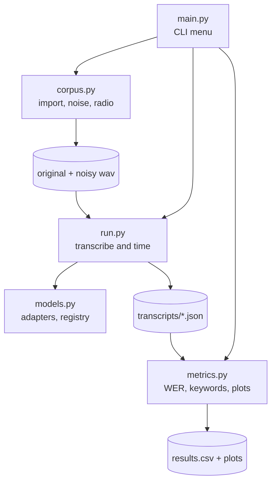
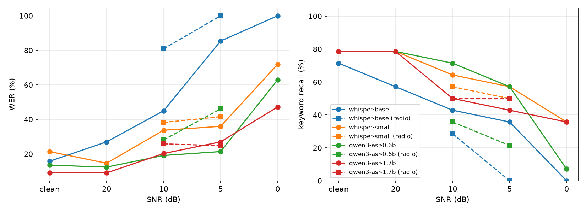
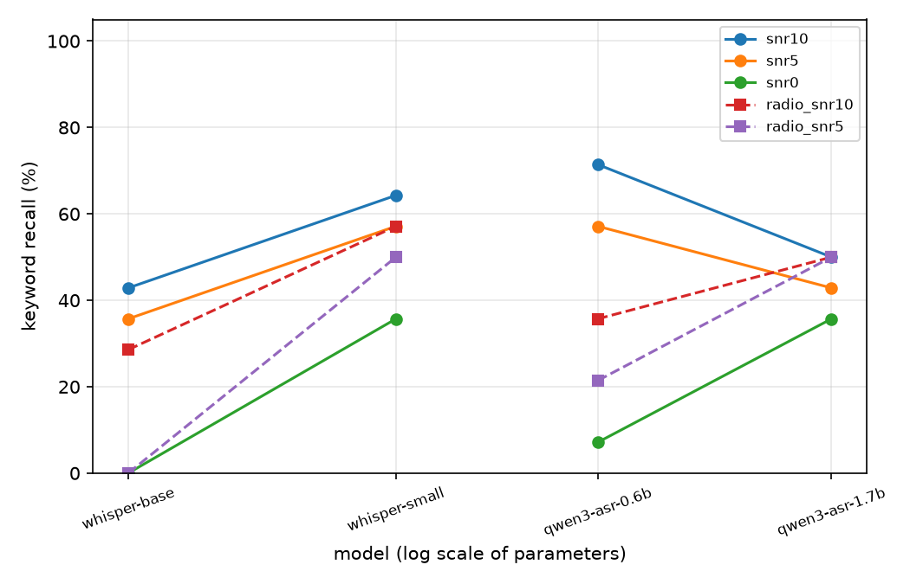

## Goal

What is the smallest speech recognition model that still holds up on a French military-style radio message as the signal degrades?

The target context is on-premise deployment, where hardware is not guaranteed, so accuracy is always read against model size and latency. Full protocol in [`spec.md`](spec.md).


## Architecture


## Setup

Dedicated environment, since `qwen-asr` pins exact versions of `transformers` and `huggingface_hub`.

```powershell
python -m venv 06_audio\.venv
06_audio\.venv\Scripts\Activate.ps1
pip install torch==2.5.1 --index-url https://download.pytorch.org/whl/cu121
pip install -r 06_audio\requirements.txt
```

## Usage

1. Record a message (about 30 seconds) and put the raw file in `Records/<session>/`, with `ground_truth.txt` (exact transcript, numbers in words) and `keywords.txt` (one keyword per line).
2. Run `python 06_audio/main.py` and choose 1 to select the session.
3. Choose 2 to import the recording and generate the degraded versions (white noise at 20, 10, 5 and 0 dB, radio band-pass at 10 and 5 dB).
4. Choose 3 to select the ASR model and 4 to select the device (cuda or cpu).
5. Choose 5 to run the model on every file of the session, one JSON per file.
6. Repeat 3 to 5 for each model to compare, then choose 6 to score the session.

## Method

- WER (word error rate), substitutions, deletions and insertions divided by the number of words in the reference, computed with `jiwer`.
- Keyword recall, share of the 14 keywords (call signs, grid coordinate, numbers, direction, rally point) found as whole words in the transcript. Closer to operational impact than WER, a missed call sign matters more than ten missed function words.
- Both reference and transcripts are normalized first (lowercase, no punctuation, no accents, numbers in words, three digits or more read digit by digit as in radio procedure). Homophones and near words remain errors.
- The normalization rules and keywords were checked on the clean transcripts, then committed before any run on the noisy files.
- Latency measured after a warmup run, model loading excluded.

## Results

Single recording, `msg01`, GPU (RTX 3090).

Keyword recall (%)

| Model | clean | 20 dB | 10 dB | 5 dB | 0 dB | radio 10 | radio 5 |
|---|---|---|---|---|---|---|---|
| whisper-base | 71.4 | 57.1 | 42.9 | 35.7 | 0.0 | 28.6 | 0.0 |
| whisper-small | 78.6 | 78.6 | 64.3 | 57.1 | 35.7 | 57.1 | 50.0 |
| qwen3-asr-0.6b | 78.6 | 78.6 | 71.4 | 57.1 | 7.1 | 35.7 | 21.4 |
| qwen3-asr-1.7b | 78.6 | 78.6 | 50.0 | 42.9 | 35.7 | 50.0 | 50.0 |

WER (%)

| Model | clean | 20 dB | 10 dB | 5 dB | 0 dB | radio 10 | radio 5 |
|---|---|---|---|---|---|---|---|
| whisper-base | 15.7 | 27.0 | 44.9 | 85.4 | 100.0 | 80.9 | 100.0 |
| whisper-small | 21.3 | 14.6 | 33.7 | 36.0 | 71.9 | 38.2 | 41.6 |
| qwen3-asr-0.6b | 13.5 | 12.4 | 19.1 | 21.3 | 62.9 | 28.1 | 46.1 |
| qwen3-asr-1.7b | 9.0 | 9.0 | 20.2 | 27.0 | 47.2 | 25.8 | 24.7 |





Speed (GPU, after warmup)

| Model | Parameters | Load time | Decode, clean | RTF, clean | Decode, degraded |
|---|---|---|---|---|---|
| whisper-base | 74 M | 0.4 s | 0.68 s | 0.022 | up to 5.3 s |
| whisper-small | 244 M | 2.6 s | 1.31 s | 0.043 | 1.2 to 1.4 s |
| qwen3-asr-0.6b | 0.6 B | 4.1 s | 6.60 s | 0.217 | 6.5 to 7.7 s |
| qwen3-asr-1.7b | 1.7 B | 14.5 s | 8.45 s | 0.278 | 7.5 to 8.5 s |

RTF (real-time factor) is processing time divided by audio duration, 0.04 means 25 times faster than real time.

## Observations

On accuracy

- WER and keyword recall disagree at 0 dB. Qwen 0.6B has a better WER than whisper-small (62.9 % against 71.9 %) but keeps 1 keyword out of 14, against 5. It produces fluent French that keeps the function words and loses the content. WER alone would have picked the wrong model.
- The radio band-pass hurts Qwen 0.6B badly (35.7 % and 21.4 % keyword recall at 10 and 5 dB, against 71.4 % and 57.1 % with white noise), Qwen 1.7B and whisper-small much less.
- Qwen 1.7B has the best WER on clean audio (9 %), but loses keywords from 10 dB, below Qwen 0.6B and whisper-small. It holds better than Qwen 0.6B in the hardest conditions.
- whisper-small degrades progressively and never collapses. On clean audio it hallucinates a subtitle credit on the trailing silence ("Sous-titrage ST' 501", six insertions), which disappears at 20 dB once noise fills the silence.
- whisper-base degrades fast below 20 dB and returns empty outputs at 0 dB and radio 5 dB, its no-speech detection discards a voice that is still there.
- All models miss the same 3 keywords even on clean audio, "Charlie Un" (weakly articulated in the take), "Uniform" (corrected to the French word "uniforme") and "nord-est".

On speed

- Whisper runs on CTranslate2, an inference engine optimized for this kind of model. Qwen runs on the plain transformers backend of `qwen-asr`, its optimized vLLM path is not available on Windows. The speed gap mostly compares two backends.
- Qwen 1.7B is only about 25 % slower than Qwen 0.6B with almost three times the parameters, decoding is dominated by the fixed cost of each generation step rather than by model size.
- whisper-base becomes up to six times slower on hard files, faster-whisper decodes again with higher temperatures when the output looks unreliable. whisper-small keeps a stable latency.


## Early conclusion

On this single recording, whisper-small is the smallest model that holds across all conditions. It is never the worst, matches Qwen 1.7B in the hardest conditions with seven times fewer parameters, and runs about six times faster with a stable latency. Qwen 0.6B is the most accurate under moderate white noise but breaks on the radio channel, Qwen 1.7B fixes that at the cost of speed, and whisper-base is only usable above 20 dB. No model is reliable at 0 dB.

## Limits

- One speaker, one message, one take, recorded on a phone and AAC-compressed (native SNR about 38.7 dB). The results show a trend on this message, they do not measure general robustness.
- With 14 keywords, one keyword is worth 7.1 points. Differences of one keyword are not meaningful.
- White noise and a band-pass filter are a simplified model of a degraded radio link.
- Latency measured once per file, on one machine.

## Next steps

- More recordings and speakers, and real recorded noise (engine, wind) instead of white noise.
- Bias the ASR towards the radio vocabulary, through context or hotwords, then fine-tuning if needed.
- A text model that corrects the raw transcript with the domain vocabulary and extracts a structured JSON (call sign, order, coordinates).
- Streaming transcription instead of complete recorded files.
- An optimized backend for Qwen (vLLM on Linux) and int8 quantization, to compare models on equal engines.
- CPU measurements.
- Apple Silicon support, MPS for the Qwen adapter, an MLX-based adapter for Whisper.