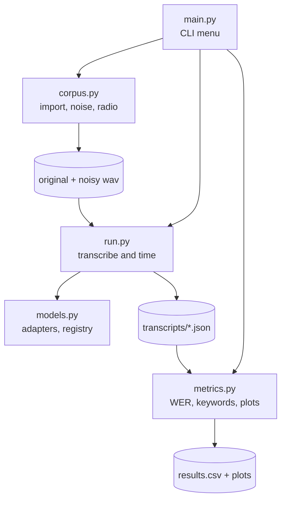

## Architecture

```mermaid
flowchart TD
    main[main.py<br/>CLI menu] --> corpus & run & metrics
    corpus[corpus.py<br/>import, noise, radio] --> wav[(original + noisy wav)]
    wav --> run[run.py<br/>transcribe and time]
    run --> models[models.py<br/>adapters, registry]
    run --> json[(transcripts/*.json)]
    json --> metrics[metrics.py<br/>WER, keywords, plots]
    metrics --> out[(results.csv + plots)]
```